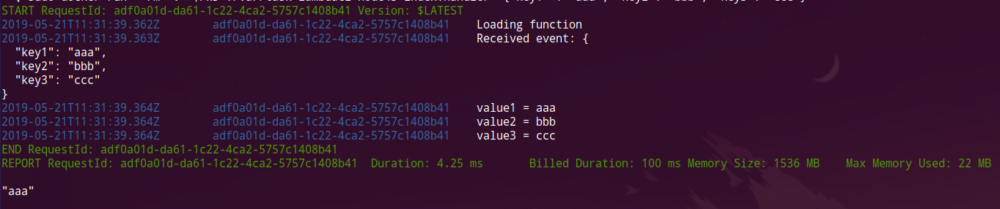

# Run example
- Build docker image
```bash
sudo docker build -f Dockerfile -t lambdaci-node43 .
```

- Run custom command
```bash
sudo docker run --rm --entrypoint node lambdaci-node43 -v
```

- Run lambda example
```bash
sudo docker run --rm -v "$PWD":/var/task lambdaci-node43 index.handler '{"key1" : "aaa", "key2": "bbb", "key3": "ccc"}'
```



# Example from 
- https://github.com/awslabs/serverless-application-model 
